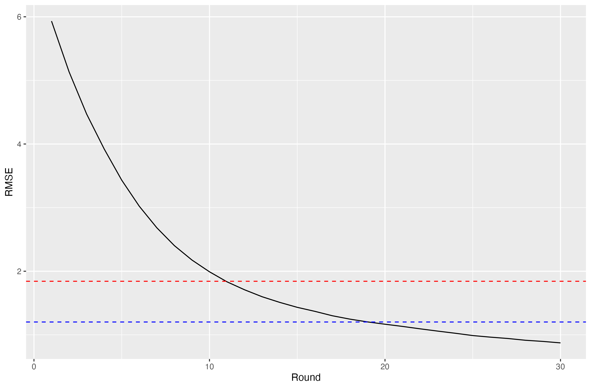

# **Gradient Boosting**

### Overview

-   Gradient boosting is an ensemble technique that combines weak learners to create a strong predictive model

-   Gradient boosting is a type of boosting model in which each model is trained on the residuals of the previous, thus increasing accuracy

-   Gradient boosting is typically performed using an R package such as XGBoost, but to further my understanding of the process, I decided to make it more manually

-   I also implemented a learning rate to ensure that the model is not over fit

### Results

-   As expected, when creating the gradient boosting model, the accuracy was significantly better than that of a single decision tree

-   The graph below shows the accuracy rate of the boosted model after different number of iterations of boosting

    {width="343"}

### Packages/Requirements

Install required packages

```{r}
install.packages("tree")
install.packages("caret")
install.packages("ggplot2")
install.packages("randomForest")
```

Load required packages

```{r}
library(tree)
library(caret)
library(ggplot2)
library(randomForest)
```
